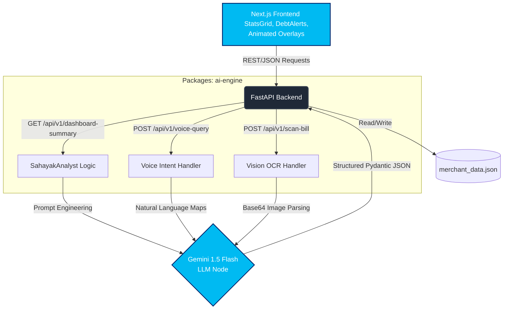

<div align="center">

# 🚀 Sahayak AI
### Empowering Bharat's Kirana Stores with AI-Driven Khata Management
**Built for the Paytm Build for India Hackathon**


</div>

## 📌 Executive Summary
**Sahayak AI** is an intelligent, multi-modal financial assistant built precisely for Indian SMBs and Kirana owners. By converging robust web frameworks with Google's cutting-edge Gemini 1.5 Flash models, Sahayak AI digitizes the traditional notebook ledger (Khata). It seamlessly translates chaotic handwritten bills and vernacular voice queries into meticulously structured JSON ledgers. 

---

## 🏗 System Architecture

The monorepo operates heavily on a Python-based core orchestrating natively with a Next.js 15 client logic.



---

## 💻 Codebase Audit

- **`/apps/server`**: The FastAPI controller hub. Houses `main.py` routing the traffic parameters for `/api/v1/dashboard-summary`, `/api/v1/voice-query`, and `/api/v1/scan-bill`. Also hosts the `mock_generator.py` for massive localized synthetic data injection.
- **`/packages/ai-engine`**: The isolated core brain. Integrates directly with the `google-genai` SDK utilizing the powerful `gemini-1.5-flash` natively. Separated cleanly into analytical endpoints (`credit_analysis.py`), visual extractors (`vision_handler.py`), and intent mappers (`voice_handler.py`).
- **`/apps/web`**: Contains the Next.js 15 frontend component tree. Features elegant implementations of the `StatsGrid` metrics, `DebtAlerts` monitoring boards, and animated `Scanning/Voice` overlays—orchestrated smoothly under a unified Tailwind UI schema mapping precisely to Paytm's Brand Blue (`#00BAF2`).

---

## ✨ Core Features: What's Built

### 1. Autonomous Business Intelligence 📈
Utilizing the `SahayakAnalyst` class inside `/packages/ai-engine`, the platform performs agentic analysis on over 200+ mock Kirana transactions. It intelligently parses JSON object structures to isolate outstanding debts, identifying the 'Top 3 Debtors' and synthetically calculating a proprietary **Credit Health Score**. The output is gracefully piped dynamically onto the frontend dashboard.

### 2. Vernacular Voice Interface 🎙️
The architecture removes extreme friction by marrying Web Speech APIs with LLM-powered intent classification (`voice_handler.py`). When a shopkeeper taps their mic and asks, *"Who owes me money?"*, the backend Gemini integration handles natural language mapping to complex database querying intents. It returns a conversational textual string and systematically generates customized **WhatsApp `wa.me` links** holding polite English/Hindi payment reminders.

### 3. Computer Vision Digitization 📸
The `SahayakVision` module enables immediate direct OCR digitization. By submitting images to the `/api/v1/scan-bill` endpoint, kirana owners bypass manual ledger entry entirely. The system securely captures raw base64 arrays of handwritten notebook bills and strictly executes Pydantic schema validation—stripping out the **Customer Name**, a categorized **Items List**, and computing the **Total Amount**, ultimately injecting them instantly as real un-paid Khata ledger blocks.

---

## 🔮 Future Roadmap (Post-Hackathon)

The foundation built natively provides vast expansion pipelines scaling directly to the Kirana network level:

- **Paytm Soundbox 2.0 Integration**: Syncing the backend debt APIs with physical Soundbox hardware for real-time audible alerts targeting delayed Khata recovery directly from the store countertops.
- **Bhashini Deep Integration**: Breaking language barriers completely by expanding the WhatsApp generative output and conversational voice intents from the current Hindi/English baseline up to all **22 official Indian languages** utilizing government AI frameworks.
- **Predictive Cash Flow Insights**: Staging time-series forecasting across the `merchant_data.json` transaction histories to precisely predict shop inventory deficit needs exactly 7 days in advance.

---

## 🚀 Setup Instructions

Get the complete infrastructure running locally on a dev build instantly:

### Phase 1: Uvicorn Backend (`FastAPI`)
1. Change into the server container:
   ```bash
   cd apps/server
   ```
2. Rapidly install the core processing requirements:
   ```bash
   pip install -r requirements.txt
   ```
3. Securely export your Gemini generative key:
   - Linux/Mac: `export GEMINI_API_KEY="your-key-here"`
   - Windows PowerShell: `$env:GEMINI_API_KEY="your-key-here"`
4. Boot the Uvicorn gateway server on port 8000:
   ```bash
   uvicorn main:app --reload
   ```

### Phase 2: Next.js Frontend
1. Open up a separate integrated terminal and traverse into the Web interface:
   ```bash
   cd apps/web
   ```
2. Verify lockfiles and fetch npm modules:
   ```bash
   npm install
   ```
3. Boot the development compiler:
   ```bash
   npm run dev
   ```
   *(Access via http://localhost:3000)*

<div align="center">
  <i>Developed for the Paytm Hackathon.</i>
</div>